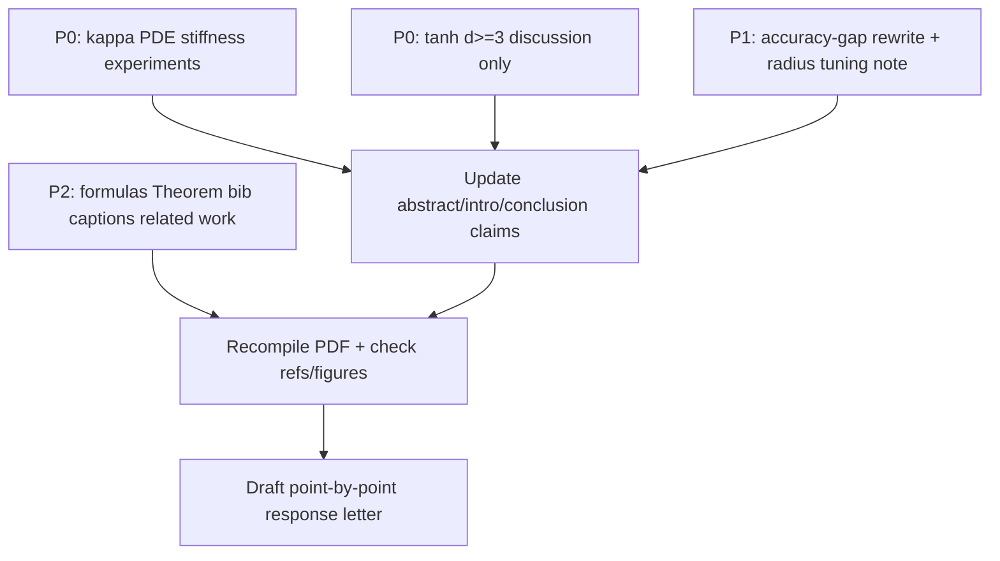

# Revision Plan: CAMWA-D-26-01150

**Paper:** Solving High-Dimensional PDEs Using Linearized Neural Networks  
**Manuscript:** `reluk_numerical_paper/main.tex`  
**Source reports:** `Paper_Review.pdf` (major revision), `CAMWA-D-26-01150_positive_referee_report.pdf` (accept after minor revision)

## Verdict summary

| Reviewer | Recommendation | Main thrust |
|----------|----------------|-------------|
| R1 | Major revision | Strengthen the conditioning “bottleneck” claim for PDEs; address tanh/Petrushev scaling beyond 2D |
| R2 | Accept after minor revision | Sharpen scope/claims, fix formulas, improve reproducibility and presentation |

The two reports are compatible. Treat **R1’s two major points as the core new work**, and fold R2’s comments into the same pass (writing, formulas, bib, figures). Aim for a single revision that satisfies both.

---

## Estimated effort and timeline

> **Deadline constraint: ~1 week left.**  
> That is tight but **feasible** if you take the crash path below: one focused PDE-$\kappa$ experiment (1D+2D, maybe 3D), **writing-only** answer to tanh/$d\ge 3$, and a same-day sweep of all formula/claim/bib fixes. Skip new tanh runs, high-$d$ $\kappa$, multi-seed re-plots, and figure re-exports.

**Headline estimate (one person, focused work):**

| Path | Scope | Person-days | Calendar time |
|------|--------|-------------|----------------|
| **1-week crash (use this)** | $\kappa(A)$ in $d=1,2$ (+ $d=3$ if easy); tanh $d\ge 3$ **discussion only**; all critical writing/math/bib; short response letter | **5–7 intense days** | **7 days** |
| Lean | PDE $\kappa(A)$ in $d=1$–$3$; tanh discussion only; all fixes | 6–9 days | ~2 weeks |
| Recommended | Above + $d=3$ tanh probe + multi-seed stats | 10–14 days | ~3–4 weeks |
| Ambitious | Recommended + higher-$d$ $\kappa$ + broader tanh + figure redo | 15–20 days | ~5–6 weeks |

### 1-week crash plan (day-by-day)

Goal: satisfy **both R1 majors** and **all cheap R2 fixes** without new long experiments.

| Day | Do this | Do **not** do |
|-----|---------|----------------|
| **Day 1** | Adapt existing Neumann variational code to dump $\kappa_2(A)$ vs $n$ for ReLU$^k$ in **1D** (and start 2D). In parallel: fix $\lambda$ / $\Lambda$, $D_B$, appendix $b_i$, Hessian PSD/PD, Neumann↔Dirichlet captions. | New tanh experiments; figure font redesign |
| **Day 2** | Finish 2D (and 3D if the notebook already runs). Make one clean figure/table for $\kappa(A)$. Soften abstract/conclusion (“comparable”, scoped randomness). | High-$d$ QMC $\kappa$; multi-seed campaigns |
| **Day 3** | Write tanh / Petrushev **scaling paragraph** for $d\ge 3$ (cost of tensor grids; why QMC/sphere is the path forward; scope limit of current numerics). Write accuracy-gap paragraph (objective vs $\kappa^2$ vs quadrature)—**no new runs**, use existing mass vs LS figure. | Optional $d=3$ tanh probe |
| **Day 4** | Radius-tuning remark/table from memory of what you already used ($R_m=8$, sphere radius sweeps in existing figs). Deduplicate `.bib` + unify cite keys. Add 2 arXiv citations + contribution-framing sentence. Soften Sobol “inherit” wording. | Re-exporting all six-panel figures |
| **Day 5** | Insert $\kappa(A)$ figure into paper; update abstract/intro sentences that claim the PDE bottleneck. Light language pass on changed sections only. | Full manuscript language edit |
| **Day 6** | Draft point-by-point response letter (honest: $d\ge 3$ tanh is discussion; seeds noted as future if not available). Coauthor quick read of abstract + response. | Waiting on perfect coauthor polish |
| **Day 7** | Buffer: fix compile errors, missing refs, figure paths; submit. If ahead, add $d=3$ $\kappa(A)$ only. | Scope creep |

**Must ship in 7 days**

1. PDE $\kappa(A)$ evidence (even **1D+2D only** answers R1 Major 1).
2. Explicit tanh/$d\ge 3$ scaling discussion (answers R1 Major 2 without new code).
3. Accuracy-gap + radius-tuning text; claim softening; formula/theorem/caption/bib fixes; short related-work note; response letter.

**Explicitly defer (mention in response if asked)**

- New tanh experiments in $d\ge 3$
- $\kappa(A)$ for $d\ge 4$
- Multi-seed mean±std re-runs (unless data already saved)
- Global figure label enlargement / full language edit

**Time budget inside the week (~40–50 focused hours)**

| Block | Hours |
|-------|------:|
| $\kappa(A)$ code + runs + 1 figure | 12–18 |
| Math/formula/theorem/caption/bib | 4–6 |
| Accuracy gap + radii + claim softening + tanh scaling text | 6–8 |
| Intro related work + Sobol wording | 2–3 |
| Response letter + submit polish | 4–6 |
| Buffer / compile / coauthor | 4–6 |

Assumption: existing notebooks under `code/RFM_H1Fitting/` can be reused for assembly/conditioning. If Day 1 assembly is broken, fall back to **1D only** $\kappa(A)$ plus a clear response sentence that 2D/3D follow the same pattern as the mass-matrix study—still better than no PDE $\kappa$.

### Effort by item

| Priority | Item | Est. person-days | In 1-week crash? |
|----------|------|------------------|------------------|
| P0 | PDE $\kappa(A)$: code + runs $d=1$–$3$ + figure/text | 2–3.5 → **trim to $d=1,2$** | **Yes (core)** |
| P0 | Extra: $\kappa(A)$ in one higher-$d$ QMC case | +0.5–1.5 | Defer |
| P0 | tanh $d\ge 3$: discussion only | 0.5 | **Yes (core)** |
| P0 | tanh $d\ge 3$: optional $d=3$ numerical probe | +1.5–3 | Defer |
| P1 | Isolate accuracy gap (rewrite ± small verification runs) | 1–2 → **rewrite only** | **Yes** |
| P1 | Document $R,r_1,r_2$ tuning (+ small table) | 0.5–1 | **Yes** |
| P1 | Soften abstract/conclusion claims | 0.25–0.5 | **Yes** |
| P2 | Formulas $\lambda$ / $\Lambda$, $D_B$, appendix $b_i$ | 0.5 | **Yes** |
| P2 | Theorem Hessian PSD vs PD | 0.25 | **Yes** |
| P2 | Deduplicate bib + Neumann/Dirichlet captions | 0.5–1 | **Yes** |
| P2 | Related work + Sobol wording; seeds/mean/std if re-run | 0.5–2 | Writing **yes**; seed re-run **defer** |
| P3 | Figure labels + language pass | 0.5–1 | Light only |
| — | Point-by-point response letter + final PDF check | 0.5–1 | **Yes** |

**Bottleneck:** P0 numerics (PDE conditioning). Keep tanh $d\ge 3$ as **discussion only**. Do all P1–P2 writing on Days 1–4 while $\kappa$ jobs run.

### Longer calendars (if the deadline moves)

| Week | Focus | Exit criteria |
|------|--------|----------------|
| **Week 1** | P0 numerics kickoff + P2 math/bib/captions in parallel | Working script for $\kappa(A)$ vs $n$; formulas/theorem/bib/captions fixed in `main.tex` |
| **Week 2** | Finish $\kappa(A)$ figures; start tanh $d\ge 3$ discussion or $d=3$ probe; accuracy-gap + radius-tuning notes | PDE conditioning figures in paper; P1 drafts in place |
| **Week 3** | Optional $d=3$ tanh / seed statistics; intro related-work; soften claims; update abstract/conclusion | All technical content frozen; only polish left |
| **Week 4** | Figure label pass; language edit; response letter; coauthor read-through | Submission-ready revision + response PDF |

**Risks that stretch even the 1-week path**

- Galerkin assembly code needs nontrivial debugging → protect Day 1–2; cut to 1D $\kappa(A)$ if needed.
- Waiting on coauthors for wording → send them abstract + response draft by Day 5, not Day 7.
- Scope creep (“quick” extra tanh run) → do not start any new experiment after Day 2.

---

## Priority overview

| Priority | Item | Type | Effort | Est. days |
|----------|------|------|--------|-----------|
| P0 | Report $\kappa(A)$ for PDE stiffness / Galerkin systems | New numerics + text | Medium–high | 2–3.5 |
| P0 | Discuss / (ideally) test Petrushev / tanh scaling for $d\ge 3$ | Discussion ± numerics | Medium | 0.5 (+1.5–3) |
| P1 | Isolate $10^{-14}$ vs $10^{-7}$ accuracy gap (quadrature / conditioning / method) | Analysis + text | Medium | 1–2 |
| P1 | Document how $R,r_1,r_2$ (and related radii) were tuned | Writing ± small table | Low–medium | 0.5–1 |
| P1 | Soften “randomness not necessary” / “superior accuracy” claims | Writing | Low | 0.25–0.5 |
| P2 | Fix loss formulas $\Lambda$ vs $\lambda$, $D_B$ notation, Appendix $b_i$ | Math edits | Low | 0.5 |
| P2 | Fix Theorem (Hessian PSD vs PD) | Proof edit | Low | 0.25 |
| P2 | Deduplicate bibliography; fix Neumann/Dirichlet caption mismatch | Cleanup | Low | 0.5–1 |
| P2 | Related-work framing + two arXiv citations; random-seed statistics; Sobol wording | Writing ± optional re-runs | Low–medium | 0.5–2 |
| P3 | Larger figure labels; language pass | Polish | Low | 0.5–1 |

---

## P0 — Required for R1 major revision

### 1. Condition numbers for the PDE linear system (not only the mass matrix)

**Reviewer ask (R1 Major 1):** Conditioning is shown only for the mass matrix; report $\kappa(A)$ for the PDE stiffness system to back the “bottleneck” claim.

**Where the paper currently stands**

- Abstract / intro / conclusion claim that variational PDE systems are severely ill-conditioned and form the main bottleneck.
- Numerics in §“Condition numbers and numerical instability” (`main.tex` ~681–757, ~1293–) report **mass-matrix** $\kappa$ for ReLU$^k$ ($d=1$–$6$) and tanh ($d=1,2$).
- PDE experiments (Neumann variational ReLU$^k$, §§762+) show error plots but **do not report $\kappa$ of the Galerkin matrix** $A_{ij}=a(\phi_j,\phi_i)$.

**Plan**

1. For the model problem $-\Delta u+u=f$ (Neumann), assemble the Galerkin matrix
   $$
   A_{ij} = \int_\Omega \nabla\phi_j\cdot\nabla\phi_i + \phi_j\phi_i\,dx
   $$
   for the same predetermined ReLU$^k$ bases used in the paper.
2. Report $\kappa_2(A)$ vs neuron count $n$ in representative dimensions (at least $d=1,2,3$; ideally also one higher-$d$ QMC case).
3. Optionally compare:
   - mass matrix $M$ vs stiffness+mass $A$ (same basis);
   - direct solve of $A\mathbf{a}=\mathbf{f}$ vs a least-squares / non-normal-equation variant if you already use one.
4. Add a short subsection or paragraph next to the existing mass-matrix figures, and **update abstract/conclusion wording** so the bottleneck claim is explicitly supported by PDE $\kappa(A)$ data.
5. Keep the existing mass-matrix study; do not remove it—R1 wants PDE evidence *in addition*.

**Deliverables:** new figure(s) and/or table(s); 1–2 paragraphs of interpretation; response-letter bullet citing them.

---

### 2. tanh / Petrushev scaling for $d\ge 3$

**Reviewer ask (R1 Major 2):** tanh experiments are 1D/2D only; discuss Petrushev scaling to $d\ge 3$.

**Where the paper currently stands**

- Deterministic tanh schemes (Petrushev + sphere) and PDE collocation are shown in 1D/2D only (§tanh ~1191–1487).
- ReLU$^k$ already goes to $d=6$ with QMC on the sphere.

**Plan (recommended dual approach)**

**A. Discussion (minimum to satisfy R1)**

In the tanh / Petrushev subsection and/or conclusion, add a clear paragraph on:

- Cost of a tensor-product Petrushev grid on $r_1 S^{d-1}\times[-r_2,r_2]$: neuron count grows like a product of sphere and bias grids, which becomes prohibitive as $d$ increases.
- Why sphere / QMC-style constructions (already used for ReLU$^k$) are the natural high-$d$ surrogate for tanh as well.
- Honest scope: current tanh evidence is low-dimensional; high-$d$ tanh deterministic schemes remain open / left to future work (unless you add experiments below).

**B. Optional but stronger: one high-$d$ numerical probe**

If time allows, add a modest $d=3$ (or $d=3$–$4$) tanh experiment, e.g.:

- Sphere-scheme (or Sobol→sphere) initialization with a few radii;
- Collocation $L^2$ fitting or the same elliptic PDE as in 2D;
- Report error vs $n$ and note conditioning / cost vs 1D–2D.

Even a single figure with a short “feasibility” discussion would substantially strengthen the response to R1.

**Deliverables:** new discussion paragraph (required); optional $d\ge 3$ figure; response-letter explanation of scaling limits.

---

## P1 — Important for both reviewers

### 3. Isolate the $10^{-14}$ vs $10^{-7}$ accuracy gap

**Reviewer ask (R1 Minor):** The gap mixes continuous-$L^2$ vs discrete-residual objectives. Isolate quadrature error, squared conditioning, and method difference before attributing it.

**Where it appears**

- Around `main.tex` ~1285–1286: collocation reaches $\sim 10^{-14}$ (1D) / $10^{-10}$ (2D); variational only $\sim 10^{-7}$ / $10^{-5}$.

**Plan**

Rewrite the comparison so the reader sees three separate effects:

| Factor | What to show or state |
|--------|------------------------|
| Objective mismatch | Variational targets continuous $L^2$ / energy; collocation targets a discrete residual / pointwise loss. Report both continuous $L^2$ (via accurate quadrature) and discrete training residual where relevant. |
| Squared conditioning | Point to Appendix remark: forming normal equations squares $\kappa$ ($\kappa(M)=\kappa(W^{1/2}\Phi)^2$). Tie to the existing mass vs variational-LS comparison (Fig. `L2min-compare-1drelu2`). |
| Quadrature | Fix / report quadrature resolution; show that refining quadrature does not close the gap once $\kappa$ is huge (you already hint at this for ReLU). |

Add a short “sources of the accuracy gap” paragraph (or remark) near the tanh variational vs collocation comparison, and soften any sentence that attributes the full gap to “method superiority” alone.

---

### 4. Document tuning of $R$, $r_1$, $r_2$ (and related radii)

**Reviewer ask (R1 Minor):** State how $R,r_1,r_2$ were tuned.

**Where it appears**

- Petrushev: $r_1 S^{d-1}\times[-r_2,r_2]$ (~1353–1380); figures use labels like `R_m_8`.
- Sphere scheme: “test a range of different sphere radii” (~1441–1474) without a clear selection rule.

**Plan**

1. Add a short subsection or remark: **parameter selection**.
2. State the practical rule used (e.g., grid search over a small set of radii; pick the value giving best validation / test $L^2$ error; or fix $R_m=8$ after pilot runs).
3. For PDE sphere-scheme figures that already sweep radii, explicitly say which radius is recommended and why (best accuracy before plateau / onset of ill-conditioning).
4. Optionally add a small table: $(d,m,r_1,r_2,R)$ used for each main figure.

---

### 5. Soften overstated claims (R1 + R2)

**Locations**

- Abstract: “random sampling … is not necessary for achieving high accuracy.”
- Conclusion (~1512–1514): same claim + “achieve **superior** accuracy” for tanh schemes.

**Plan**

1. Scope the randomness claim: *for the smooth test problems considered here*, deterministic features match (or can match) random ELM/RFM baselines; not a universal theorem.
2. Replace “superior” with “comparable” (or “comparable and sometimes better”) unless you keep multi-seed statistics that clearly support superiority (see item 9).
3. Mirror the same wording in the abstract and conclusion.

---

## P2 — Precision, formulas, bibliography, related work

### 6. Fix collocation loss formulas and Appendix $b_i$ (R2 §3)

**Issues**

- Loss (11) / `loss` weights residuals by $\lambda_i$, while matrix form (12) / `loss-matrix` uses $\|\Lambda r\|_2^2$, which effectively weights by $\lambda_i^2$.
- $D_B$ entry has a notation error: currently something like $\mathcal{B}\phi_j(x_i)(x_i^b)$ (~534).
- Appendix B: formula for $b_i$ appears to omit factor $\phi_i(x_k)$ (R2); check the displayed $b_i=\sum w_k u(x_k)$ vs $b_i=\sum w_k u(x_k)\phi_i(x_k)$.

**Plan**

1. Make (11) and (12) consistent: either define $\Lambda=\mathrm{diag}(\sqrt{\lambda})$ or rewrite the scalar loss with $\lambda_i^2$, and say so explicitly.
2. Correct $D_B$: $[D_B]_{i,j}=\mathcal{B}\phi_j(x_i^b)$.
3. Fix Appendix mass-vector formula and re-read the proof paragraph for consistency.

---

### 7. Theorem on weighted least squares — Hessian PSD vs PD (R2 §4)

**Location:** Appendix “Variational least-squares formulation”, theorem ~1652–1711.

**Plan**

In the proof, separate:

- Hessian $2\Phi^\top W\Phi$ is always **positive semidefinite**;
- It is **positive definite** (unique minimizer) when $W\succ 0$ and $\Phi$ has full column rank.

Do not claim $\nabla^2 L\succ 0$ unconditionally (~1688–1690 as currently written).

---

### 8. Figure caption / BC naming mismatch (R2 §5)

**Issue:** Fig. `2dNeumann_tanh_sphere` (~1483) caption says “2D Neumann problem”, while the surrounding text (~1459) says Dirichlet BCs for the same elliptic operator.

**Plan**

- Decide the actual BC used in the experiment (filenames suggest PINN/Dirichlet collocation).
- Make caption, label, and text agree (likely: “Dirichlet problem” / “elliptic BVP with Dirichlet BCs”).
- Check the 1D companion figure for the same inconsistency.

---

### 9. Random baselines: seeds, mean, and spread (R2 §2)

**Plan**

- For random ELM/RFM comparison figures (e.g. QMC vs random on $S^d$), report mean ± std (or min/max) over several seeds and list the seeds.
- If re-running is costly, at least document existing protocol and add a reproducibility sentence; prefer a light re-plot for the main 3D/5D comparison figures if data are available in `code/RFM_H1Fitting/data-compare-rand/`.

---

### 10. Sobol → sphere “inherit low discrepancy” wording (R2 §2)

**Location:** ~933.

**Plan**

Either cite a reference that supports discrepancy inheritance under the map, or rephrase to: points are *approximately* uniformly distributed on $S^d$; low-discrepancy properties of the cube sequence motivate the construction, without claiming inheritance as a theorem.

---

### 11. Scope of contribution + related preprints (R2 §1)

**Plan**

In the introduction, add 1 short paragraph that:

1. States the contribution is primarily a **combined numerical study** of fixed-feature networks (Galerkin vs collocation, deterministic tanh schemes, tests through $d=6$), not a new convergence theorem.
2. Cites and distinguishes:
   - He–Liang–Zhao–Zhong, *What Can One Expect When Solving PDEs Using Shallow Neural Networks?*, arXiv:2510.27658;
   - Mao–Xu, *Sharp Lower Bounds for Linearized ReLU$^k$ Approximation on the Sphere*, arXiv:2510.04060.

---

### 12. Deduplicate references (R1 + R2)

**Reviewer notes:** duplicate refs such as `[31]≡[2]`, `[40]≡[16]`; also PINN / RFM / greedy duplicates.

**Observed in `reference.bib`:** clear duplicates include `butcher2004numerical`, `he2022relu`, `xu1992iterative`, `tai2002global`, `park2020additive`; also overlapping PINN keys (`raissi2019physics` vs `RPK:2019`) and QMC keys (`caflisch1998monte` vs `Caflisch:1998`, etc.).

**Plan**

1. Deduplicate `.bib` entries; keep one key per work.
2. Grep `main.tex` for obsolete cite keys and unify (especially PINN, RFM, greedy/OGA).
3. Recompile and verify the reference list has no repeated titles.

---

## P3 — Presentation polish

- Increase font / tick label size on six-panel condition-number and error figures (`1drelu.png` … `6drelu2.png`, etc.).
- Final language edit for grammar and notation consistency (ReLU$^k$ vs ReLU^k, variational vs Galerkin, etc.).
- Ensure figure filenames/captions no longer say “Neumann” when the experiment is Dirichlet.

---

## Suggested work order

**Default under the current deadline:** follow the **1-week crash plan** in the timeline section above.

1. **Days 1–2:** $\kappa(A)$ for PDE (1D+2D); formula/theorem/caption fixes in parallel.
2. **Days 3–4:** tanh $d\ge 3$ discussion; accuracy-gap + radii; bib + related work; soften claims.
3. **Day 5:** insert figures; update abstract/intro/conclusion.
4. **Days 6–7:** response letter, compile check, submit.

---

## Response-letter skeleton (draft later)

For each item below, cite the revised section/figure:

**Reviewer 1**

1. Major — PDE $\kappa(A)$: …
2. Major — tanh / Petrushev $d\ge 3$: …
3. Minor — accuracy gap isolation: …
4. Minor — tuning of $R,r_1,r_2$: …
5. Minor — duplicate refs + “superior” → “comparable”: …

**Reviewer 2**

1. Contribution framing + two arXiv papers: …
2. Scoped randomness claim; seeds/mean/std; Sobol wording: …
3. Consistent $\lambda$ / $\Lambda$; fix $D_B$; fix $b_i$: …
4. Hessian PSD vs PD: …
5. Neumann/Dirichlet caption; duplicates; figure labels; language: …

---

## Out of scope (unless you choose to expand)

- Full high-dimensional tanh PDE campaign ($d=5,6$) — not required if scaling discussion (+ optional $d=3$) is clear.
- New preconditioner theory — reviewers ask for evidence and precision, not a new solver paper.
- New convergence theorems — R2 explicitly says the contribution is numerical; keep that emphasis.

---

## Quick file map

| Topic | Primary location in `main.tex` |
|-------|--------------------------------|
| Abstract claims | ~80–89 |
| Intro / contributions | ~92–180 |
| Collocation loss (11)–(12) | ~519–535 |
| Mass-matrix conditioning | ~681–757, ~1293– |
| PDE Neumann ReLU experiments | ~762–995 |
| Sobol→sphere wording | ~914–933 |
| tanh var vs col accuracy gap | ~1285–1286 |
| Petrushev / sphere radii | ~1343–1487 |
| Dirichlet/Neumann mismatch | ~1429–1487 |
| Conclusion claims | ~1508–1536 |
| Weighted LS theorem / appendix | ~1625–1726 |
| Bibliography | `reference.bib` |
